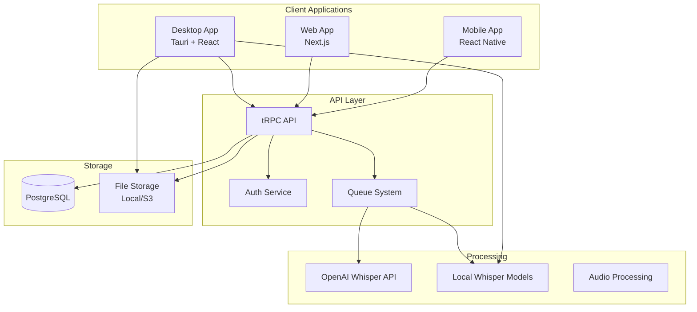

# VoiceGecko Architecture

## System Overview

VoiceGecko is a multi-platform voice transcription application built with a hybrid architecture that supports both cloud-based and local processing. The system is designed for scalability, privacy, and performance.



## Technology Stack

### Frontend

- **Desktop**: Tauri (Rust) + React + TypeScript
- **Web**: Next.js 14 + React + TypeScript
- **Mobile**: React Native + Expo
- **UI Components**: shadcn/ui + Tailwind CSS
- **State Management**: TanStack Query + Zustand
- **Routing**: TanStack Router (Desktop), Next.js App Router (Web)

### Backend

- **API**: tRPC with TypeScript
- **Database**: PostgreSQL with Drizzle ORM
- **Authentication**: better-auth
- **File Storage**: Local filesystem (MVP), S3-compatible (future)
- **Queue System**: In-process (MVP), Redis/BullMQ (future)

### Audio Processing

- **Cloud**: OpenAI Whisper API
- **Local**: whisper.cpp / whisper-rs
- **Audio Format**: WebM with Opus codec
- **Conversion**: FFmpeg

## Core Components

### 1. Audio Recording Module (Tauri)

Handles cross-platform microphone access and audio capture:

- Uses `cpal` for audio device management
- Records in WAV format initially
- Converts to WebM/Opus for storage efficiency
- Supports pause/resume functionality

### 2. Transcription Engine

Intelligent routing between cloud and local processing:

- Hardware detection for capability assessment
- Model selection based on available resources
- Fallback mechanisms for reliability
- Progress tracking and cancellation

### 3. Storage System

Hierarchical file organization:

```
storage/
├── audio/
│   └── {userId}/
│       └── {yyyy-mm-dd}/
│           └── {timestamp}-{uuid}.webm
└── models/
    ├── whisper-tiny.pt
    ├── whisper-base.pt
    └── whisper-small.pt
```

### 4. Database Schema

Core tables:

- `users` - User accounts and authentication
- `transcriptions` - Transcription records and metadata
- `recordings` - Recording sessions
- `usage_tracking` - Usage quotas and limits
- `user_preferences` - Settings and preferences

## Data Flow

### Recording Flow

1. User initiates recording via UI or keyboard shortcut
2. Tauri captures audio from microphone
3. Audio is saved as WAV temporarily
4. FFmpeg converts to WebM/Opus
5. File is stored in user's directory
6. Database record created with metadata

### Transcription Flow

1. Audio file queued for processing
2. System checks user quota
3. Model selection based on:
   - User preferences
   - Hardware capabilities
   - Model availability
4. Processing via selected engine
5. Results stored in database
6. Usage tracking updated

### Authentication Flow

1. User signs in via Discord OAuth
2. better-auth handles OAuth flow
3. Session created and stored
4. JWT tokens for API access
5. Refresh tokens for long-lived sessions

## Security Considerations

### Data Privacy

- Audio files stored locally (never uploaded in MVP)
- Transcriptions encrypted at rest
- User data isolation via PostgreSQL RLS
- Secure session management

### API Security

- tRPC with type-safe procedures
- Authentication required for all endpoints
- Rate limiting on API calls
- Input validation with Zod schemas

### Desktop Security

- Tauri's security model
- CSP headers configured
- No remote code execution
- Sandboxed file access

## Scalability Design

### Current (MVP)

- Single server deployment
- In-process job queue
- Local file storage
- SQLite/PostgreSQL database

### Future Scaling

- Microservices architecture
- Redis queue with workers
- S3-compatible object storage
- Read replicas for database
- CDN for static assets
- Horizontal scaling with load balancer

## Performance Optimizations

### Frontend

- React Query for caching
- Virtualized lists for large datasets
- Lazy loading of components
- WebM/Opus for smaller file sizes

### Backend

- Database indexes on common queries
- Pagination for list endpoints
- Efficient file streaming
- Connection pooling

### Audio Processing

- Optimal model selection
- Batch processing support
- Concurrent transcriptions
- Model caching in memory

## Monitoring & Observability

### Metrics to Track

- API response times
- Transcription processing duration
- Model accuracy comparisons
- Storage usage per user
- Error rates by endpoint

### Logging Strategy

- Structured logging with context
- Error tracking with stack traces
- User action audit trail
- Performance profiling

## Deployment Architecture

### Development

```
Local Development
├── PostgreSQL (Docker)
├── Tauri Dev Server
├── Next.js Dev Server
└── tRPC API Server
```

### Production

```
Production Environment
├── Database Cluster (Supabase/Neon)
├── API Servers (Vercel/Railway)
├── Desktop App (GitHub Releases)
├── Web App (Vercel)
└── File Storage (Local/S3)
```

## Future Enhancements

### Technical Debt

- [ ] Implement proper job queue system
- [ ] Add comprehensive error recovery
- [ ] Optimize model loading times
- [ ] Implement caching strategies

### Feature Roadmap

- [ ] Real-time transcription
- [ ] Multi-language support
- [ ] Team collaboration
- [ ] API for third-party integrations
- [ ] Mobile app development
- [ ] Batch processing
- [ ] Custom vocabulary support
